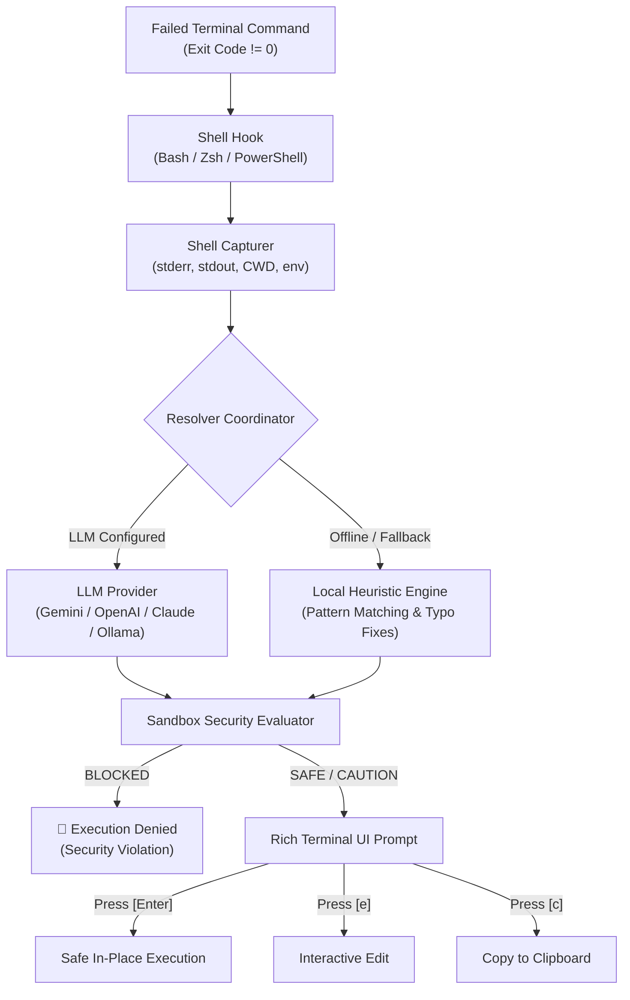

# ⚡ TermiMind

<div align="center">

[](LICENSE)
[](https://www.python.org/)
[](#-shell-hooks-setup)
[](#)
[](#-sandbox--security-model)

**AI-powered, sandbox-protected terminal command fixer with Bash, Zsh, and PowerShell hooks.**  
*Fix exploded commands instantly with a single [Enter] keystroke.*

[Features](#-key-features) • [Installation](#-installation) • [Shell Hooks](#-shell-hooks-setup) • [Quickstart](#-quickstart) • [Sandbox Safety](#-sandbox--security-model) • [Architecture](#-architecture) • [Configuration](#-configuration)

</div>

---

## 🌟 Overview

Have you ever mistyped a long Git branch, forgotten a Python virtual environment flag, misspelled a package name, or had a Docker container command fail with cryptic exit codes?

**TermiMind** (`termimind` / `tm`) intercepts failed terminal commands in real-time across **Bash**, **Zsh**, and **PowerShell**. It analyzes the stderr/stdout context, operating system environment, and directory files to synthesize verified, safe fixes using LLMs (Gemini, OpenAI, Claude, Ollama) and a 100% offline rule-based heuristic layer.

Best of all: **Press `[Enter]` to run the fix immediately.** No copying, no retyping.

---

## 🚀 Key Features

- **⚡ Instant 1-Key Execution**: Press `[Enter]` to run the proposed fix, `[e]` to edit, `[c]` to copy, `[a]` for alternatives, or `[q]` to dismiss.
- **🛡️ Sandbox & Security Guard**: Built-in multi-tier sandbox proactively blocks destructive or malicious commands (such as `rm -rf /`, raw disk formatting, fork bombs, remote script pipes like `curl ... | bash`, and sensitive credential access).
- **🔌 Native Shell Hooks**: Zero-lag hooks for **Bash**, **Zsh**, and **PowerShell** that capture failure contexts seamlessly without disrupting your normal shell prompt or external themes (Starship, Oh My Posh, etc.).
- **🧠 Dual-Engine Resolution**:
  - **LLM Engine**: High-reasoning fixes with Google Gemini, OpenAI, Anthropic Claude, or local Ollama / LM Studio.
  - **Local Fallback Engine**: Lightning-fast, zero-token, 100% offline rule engine for Git errors, Python/Pip module mappings (`cv2` ➔ `opencv-python`), npm/pnpm typos, file fuzzy matching, and permission flags.
- **🎨 Modern Rich UI**: Syntax-highlighted diffs, clear error diagnosis, safety rating badges, and confidence scoring right in your terminal.
- **🔒 Privacy First**: Operates locally by default; telemetry-free and customizable.

---

## 🏗️ Architecture



---

## 📦 Installation

### Via Pip (Local or Repository)

```bash
# Clone the repository
git clone https://github.com/EvoderDev/TermiMind.git
cd TermiMind

# Install package and dependencies
pip install -e .
```

After installation, both `termimind` and its shortcut `tm` will be available in your PATH.

---

## 🔌 Shell Hooks Setup

Enable automatic failure capturing in your favorite shell by adding the hook to your startup configuration:

### 1. PowerShell (Windows / macOS / Linux)

Open or edit your PowerShell profile (`$PROFILE`):
```powershell
# Open profile in editor
notepad $PROFILE
```

Add this line to the end of your profile:
```powershell
. "C:\Users\<YourUser>\TermiMind\hooks\termimind.ps1"
```
*(Or run `tm hook powershell` to view setup details).*

### 2. Bash (Linux / macOS / WSL)

Add the hook to your `~/.bashrc`:
```bash
# Append to ~/.bashrc
source /path/to/TermiMind/hooks/termimind.bash
```

### 3. Zsh (macOS / Linux)

Add the hook to your `~/.zshrc`:
```zsh
# Append to ~/.zshrc
source /path/to/TermiMind/hooks/termimind.zsh
```

Restart your shell or run `source ~/.bashrc` / `source ~/.zshrc`.

---

## 💡 Quickstart & Usage

### Manual Trigger (`tm` or `termimind`)

Run any command that fails. Then simply type `tm`:

```bash
$ git cmmit -m "Initial commit"
git: 'cmmit' is not a git command. See 'git --help'.

$ tm
```

**TermiMind interactive prompt appears:**

```text
 ⚡ TermiMind   v1.0.0 • local_fallback

Failed: git cmmit -m "Initial commit" (exit code: 1)        ✔ SAFE

─────────────────────────────── Suggested Safe Fix ───────────────────────────────
  git commit -m 'initial commit'
──────────────────────────────────────────────────────────────────────────────────
💡 Explanation: Corrected Git subcommand typo 'cmmit' -> 'commit'.
🛡️  Sandbox: Command inspected and verified safe by sandbox policy.

👉 [Enter] Run fix  [e] Edit  [c] Copy  [q] Cancel:
```

Press **`[Enter]`** and the command runs immediately!

---

### Non-Interactive & Scripting Options

```bash
# Preview fix without running or prompting (dry run)
tm fix --dry-run

# Automatically accept and run safe fixes without interactive prompt
tm fix --yes

# Force offline local rule engine (ignore LLM)
tm fix --local

# Manually provide failed command and stderr
tm fix --command "python app.py" --stderr "ModuleNotFoundError: No module named 'cv2'"
```

---

## 🛡️ Sandbox & Security Model

TermiMind is built with a defense-in-depth security layer that analyzes all proposed commands before they reach your console:

| Risk Level | Visual Badge | Description & Behavior |
| :--- | :--- | :--- |
| **SAFE** | `✔ SAFE` | Read-only commands, standard installs, directory navigation. Runs with single `[Enter]`. |
| **CAUTION** | `⚠ CAUTION` | Modifies configuration or files (e.g., `git stash drop`, `npm uninstall`). |
| **DANGEROUS** | `⚡ DANGEROUS` | Commands with potential data loss (e.g., `git push --force`, `git reset --hard`). Requires explicit confirmation. |
| **BLOCKED** | `✖ BLOCKED` | **Strictly prohibited**. Prohibited from single-key execution under all circumstances. |

### Prohibited / Blocked Operations
- **Root/Disk Wipes**: `rm -rf /`, `rm -rf ~`, `del /s /q C:\*`, `Remove-Item -Recurse -Force /`
- **Raw Disk Writes & Formatting**: `mkfs`, `dd of=/dev/sd*`, `format C:`
- **Fork Bombs**: `:(){ :|:& };:`, `%0|%0`
- **Remote Code Execution Pipes**: `curl ... | bash`, `wget ... | sh`, `irm ... | iex`
- **Privilege Exposure**: `chmod -R 777 /`, reading private keys (`~/.ssh/id_rsa`, `/etc/shadow`)

You can test any command against the sandbox directly:
```bash
tm sandbox "rm -rf /"
# ➔ [bold red]✖ BLOCKED (PROHIBITED)[/bold red]
```

---

## ⚙️ Configuration

Settings are saved in `~/.termimind/config.json`. You can manage them via CLI:

```bash
# List all active configurations
tm config list

# Set LLM provider ("gemini", "openai", "anthropic", "ollama", "local", "auto")
tm config set llm_provider gemini

# Set API key
tm config set api_key "YOUR_API_KEY"

# Set model
tm config set model "gemini-2.5-flash"

# Enable automatic popup whenever any command fails
tm config set auto_trigger true

# Set safety mode ("strict", "moderate", "permissive")
tm config set safety_mode strict
```

### Environment Variable Overrides

| Environment Variable | Description |
| :--- | :--- |
| `TERMIMIND_LLM_PROVIDER` | Active LLM provider (`gemini`, `openai`, `anthropic`, `ollama`, `local`) |
| `TERMIMIND_API_KEY` | Primary API Key (also recognizes `GEMINI_API_KEY`, `OPENAI_API_KEY`) |
| `TERMIMIND_MODEL` | Specific LLM model name |
| `TERMIMIND_SAFETY_MODE` | Safety mode: `strict`, `moderate`, or `permissive` |
| `TERMIMIND_PREFER_LOCAL` | Set to `1` to force offline heuristic engine |
| `TERMIMIND_AUTO_TRIGGER` | Set to `1` to automatically trigger TermiMind on failed commands |

---

## 🧪 Testing

Run the full automated test suite:

```bash
# Run with pytest
pytest -v

# Or run with Python unittest
python -m unittest discover tests
```

---

## 📄 License

This project is licensed under the **Apache License, Version 2.0**.  
Copyright © 2026 **EvoderDev**.

See the [LICENSE](LICENSE) file for the full license text.
